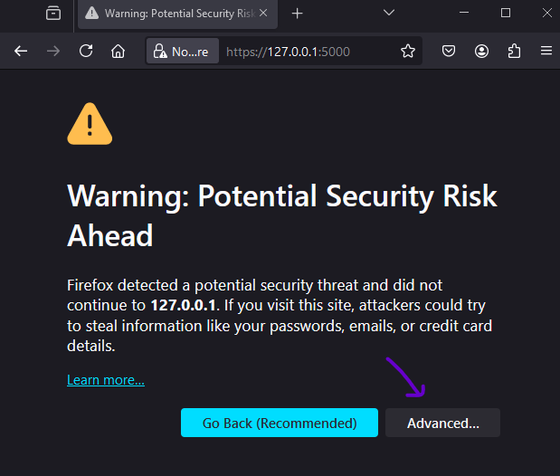

# live sensors server

## Installation 


#### Python Installation
- create a VE (i'm using 3.12)
- ```python.exe -m pip install --upgrade pip```
- ```pip install -r requirements.txt```

#### Modern javascript insanity installation
- install npm (and node). [Instructions](https://docs.npmjs.com/downloading-and-installing-node-js-and-npm)
- you will need to retart your IDE as npm has added stuff to you path
- ```npm install```

#### Install https for dev
- this project uses WebSockets. WebSockets are annoying and require https.
- via instructions provided [here](https://ngrok.com/):
    - install [ssl](https://www.wilivm.com/blog/install-openssl-on-windows-10-11/)
    - create certficate ```openssl req -new -newkey rsa:2048 -nodes -keyout https.key -x509 -days 3650 -out https.crt```

## Local dev
- start quart server ```quart --app app --debug run --cert=https.crt --key=https.key```
- start parcel (js) bundling insanity ```npm run dev```
- start ngrok ```ngrok http http://127.0.0.1:5000```
- visit the https server ngrok provides. Hey presto.
- Note you'll get the below message but ...

